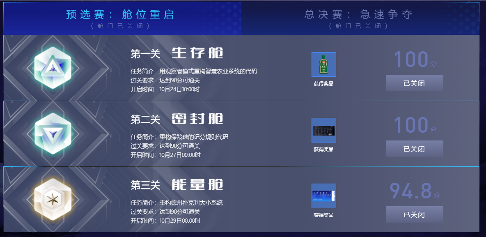
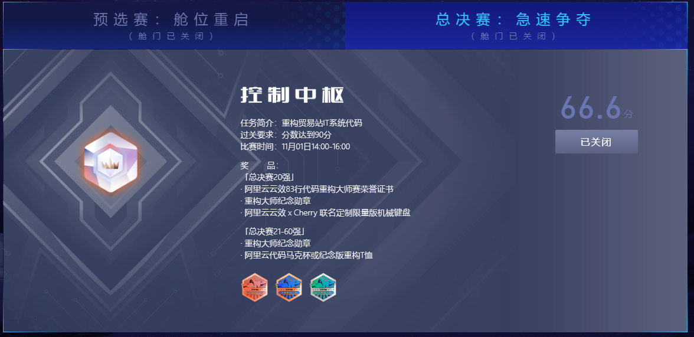
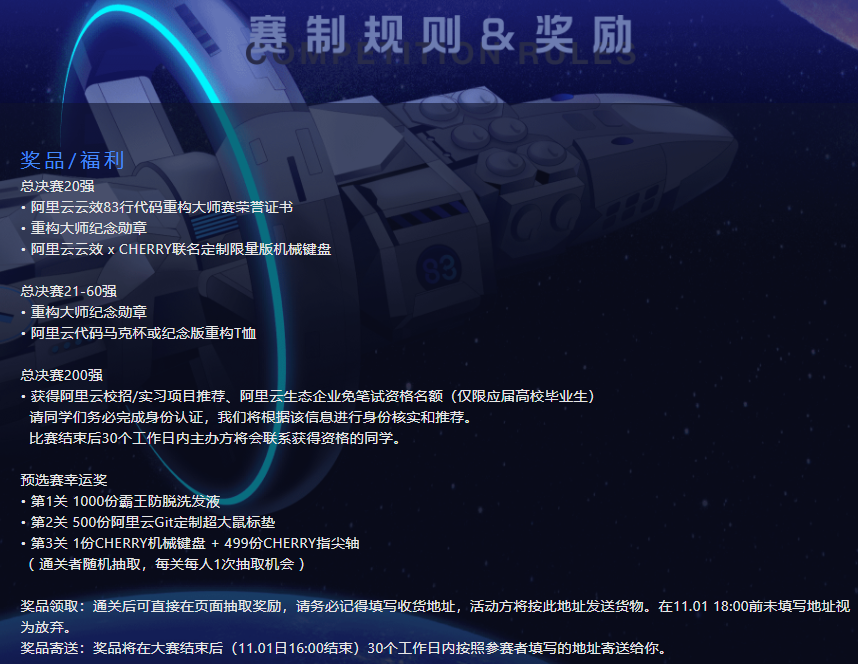

> 你好，欢迎来到阿里云83行代码大赛，以下是大赛4个关卡代码
>
> [官方大赛页地址，戳我进入](https://college.devops.aliyun.com/)

**[重构视频讲解地址，戳我进入]()**

### 分支介绍

- `main`分支为君哥讲解实现后的分支（重构后的代码）

- `init`分支为阿里云`codeup`大赛原代码分支（重构前的比赛代码）

### 关卡项目介绍

- 第一关：`weather-machine-baseline`，重构智能农业系统

- 第二关：`bowling`，重构保龄球计分规则

- 第三关：`poker`，重构德州扑克评判系统

- 总决赛：`store`，重构

### 大赛规则

https://college.devops.aliyun.com/regulations

